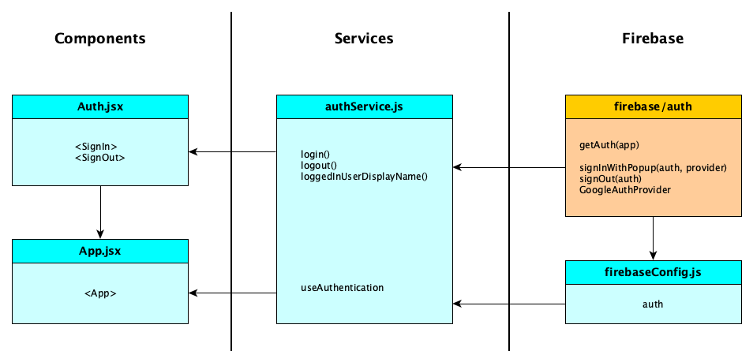
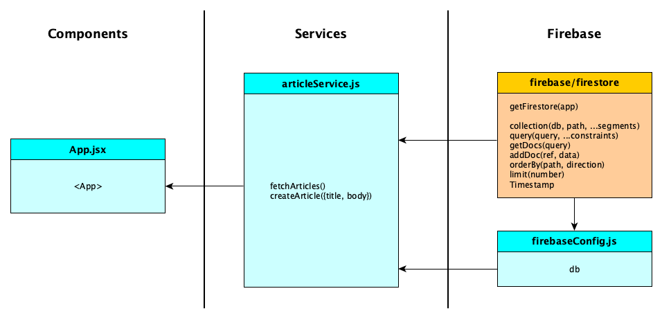

# A Blog Starter App

This is a trivial blog app, started with Vite.

It works entirely within memory, so reloads blow everything away except for the first two mock articles.

This repo is designed for you to fork and extend with (1) better CSS and (2) a real back end, with authentication and a database.

##  Getting Started

1. Clone this repository:
   ```sh
   git clone https://github.com/humeraaa/blog-starter-bscs.git
   cd blog-starter-bscs

2. Install dependencies:
     npm install

3. Run the development server
    npm run dev

## Preview



# Reference
https://github.com/lmucs/blog-starter-app
